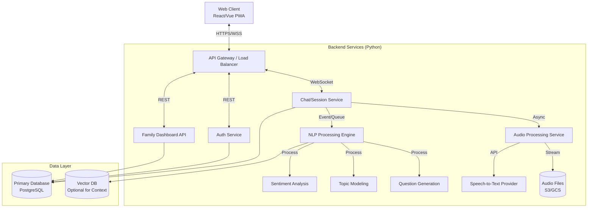

# Memory Keeper Chatbot - System Architecture Design

**Response to Prompt 1.1**

## 1. System Architecture Diagram

The system follows a microservices-ready modular monolith architecture, which allows for ease of development initially while enabling scalability for specific components (like NLP or Audio processing) later.



## 2. Technology Stack Recommendations

| Component              | Technology                                     | Rationale                                                                                                                          |
| ---------------------- | ---------------------------------------------- | ---------------------------------------------------------------------------------------------------------------------------------- |
| **Backend Framework**  | **FastAPI** (Python)                           | High performance, native async support for WebSockets (critical for chat), automatic OpenAPI docs, excellent for ML integration.   |
| **Frontend Framework** | **React.js** + **Vite**                        | Robust ecosystem, component reusability, excellent PWA support.                                                                    |
| **Database**           | **PostgreSQL**                                 | Reliable relational data (Users, Families), supports JSONB for flexible story schemas, and vector extensions (pgvector) if needed. |
| **Real-time Comms**    | **Socket.IO** / **WebSockets**                 | Essential for seamless chat experiences and streaming audio.                                                                       |
| **State Management**   | **Zustand** or **Redux Toolkit**               | Managing complex chat states and audio recording status.                                                                           |
| **Styling**            | **Tailwind CSS**                               | Rapid UI development, easy to implement high-contrast/accessibility themes.                                                        |
| **Task Queue**         | **Celery** + **Redis**                         | Offloading heavy NLP tasks and audio interaction logic.                                                                            |
| **STT/TTS**            | **OpenAI Whisper** (STT), **ElevenLabs** (TTS) | Best-in-class accuracy for diverse speech patterns.                                                                                |

## 3. Scalability Considerations

1.  **Stateless API Design**: The core API services are stateless. User session state is stored in Redis, allowing horizontal scaling of backend containers.
2.  **Asynchronous Processing**: Long-running tasks (transcription, topic modeling) are decoupled using message queues (Celery/Redis). The chat interface doesn't block waiting for these.
3.  **Database Partitioning**: As conversation logs grow, the database can be partitioned by `FamilyID` or `Time` to maintain query performance.
4.  **CDN for Media**: Audio files and static assets will be served via CDN to reduce load on the application server and improve latency for users.
5.  **Microservices Readiness**: The separation of "NLP Engine" and "Audio Service" in the code structure allows them to be deployed as independent services if CPU load becomes disparate.
6.  **WebSocket Scaling**: Using a pub/sub mechanism (Redis PubSub) allows WebSocket connections to be distributed across multiple server instances.

## 4. Proposed Folder Structure

```
memory-keeper/
├── backend/                  # Python/FastAPI Backend
│   ├── app/
│   │   ├── api/             # API Endpoints
│   │   │   ├── v1/
│   │   │   │   ├── auth.py
│   │   │   │   ├── chat.py
│   │   │   │   └── stories.py
│   │   ├── core/            # Config, Security, DB connections
│   │   ├── models/          # SQLModel/Pydantic Models
│   │   ├── services/        # Business Logic
│   │   │   ├── nlp/         # NLP Pipeline Modules
│   │   │   ├── audio/       # Audio Processing
│   │   │   └── conversation.py # Dialogue Manager
│   │   └── main.py
│   ├── tests/
│   ├── requirements.txt
│   └── Dockerfile
├── frontend/                 # React Frontend
│   ├── src/
│   │   ├── components/      # Reusable UI components
│   │   ├── features/        # Feature-based modules (Chat, Dashboard)
│   │   ├── hooks/           # Custom React hooks
│   │   ├── services/        # API clients
│   │   └── App.jsx
│   ├── package.json
│   └── vite.config.js
├── docs/                     # Documentation
├── data/                     # Local interaction data (ignored in git)
└── docker-compose.yml
```
