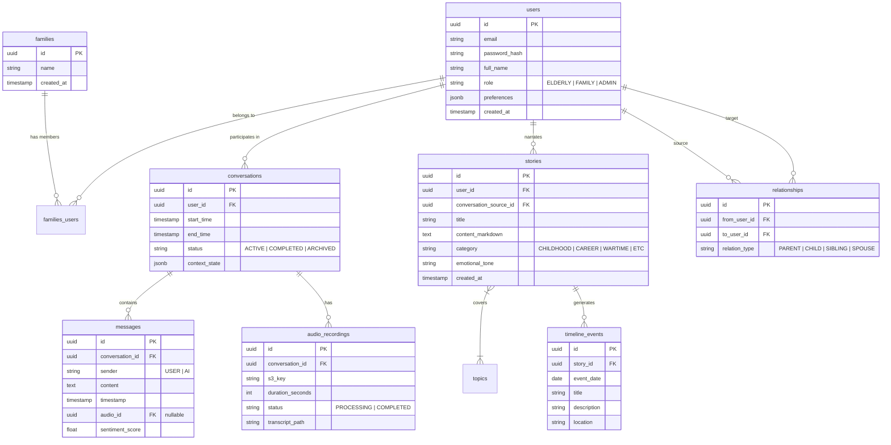

# Database Schema Design

**Response to Prompt 1.2**

## 1. Entity-Relationship Diagram (ERD)

## 2. Table Definitions & Strategies

### Core Tables

**1. Users**

- **Purpose**: Stores authentication and profile info.
- **Indexing**: `email` (Unique), `role` (B-tree for filtering).

**2. Conversations**

- **Purpose**: Tracks chat sessions.
- **Indexing**: `user_id` + `start_time` (Composite index for "My History").

**3. Stories (The Core Asset)**

- **Purpose**: Refined narratives extracted from raw chat.
- **Data Types**: `content_markdown` (Text), `category` (Enum).
- **Indexing**: `user_id`, `category` (Bitmap scan capable).

**4. Audio Recordings**

- **Purpose**: links to raw audio in Object Storage.
- **Optimization**: Store metadata here. actual binary data in S3/MinIO.

### Semantic & Analysis Tables

**5. Topics**

- **Purpose**: Tracks coverage of different life areas.
- **Structure**: `id`, `name`, `description`, `parent_topic_id`.

**6. Timeline Events**

- **Purpose**: Structured data for the Timeline Visualization features.
- **Data Types**: `event_date` (Date, allowing fuzzy dates if needed via separate fields).

### Scalability & Performance

1.  **JSONB for Flexibility**:
    - The `context_state` in `conversations` is JSONB. This allows the NLP engine to store arbitrary state (current mood, last discussed entity, exhausted topics) without schema migrations.
2.  **Vector Embeddings (Extension)**:
    - Future-proofing: A `embeddings` table linked to `stories` using `pgvector` will allow semantic search ("Show me stories about resilience").
3.  **Partitioning**:
    - `messages` table will grow effectively infinite. Partitioning by `created_at` (Monthly) is recommended for long-term retention.
